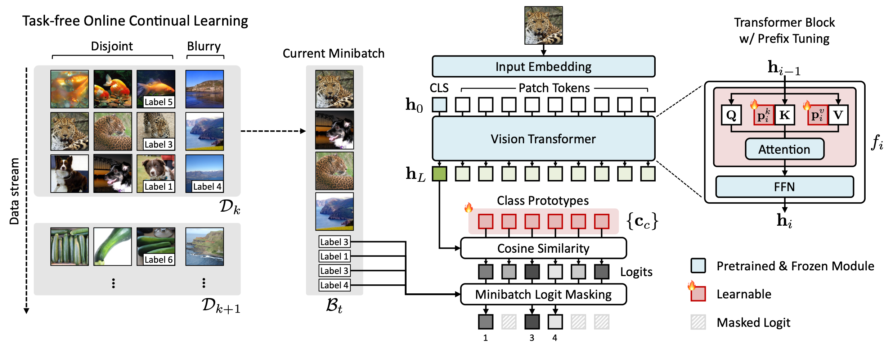
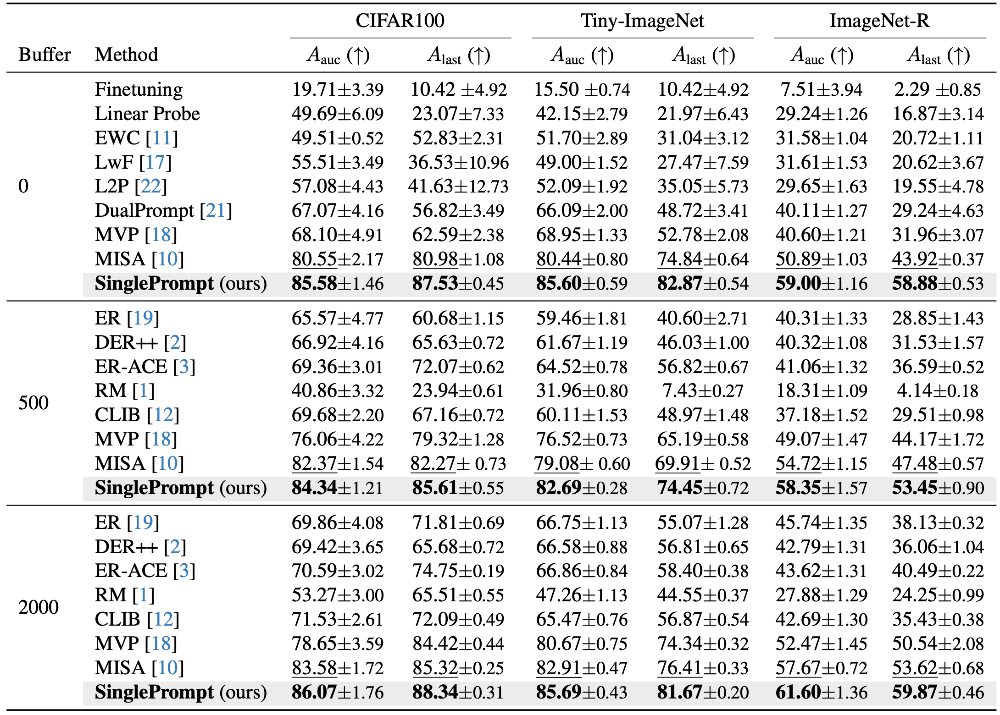
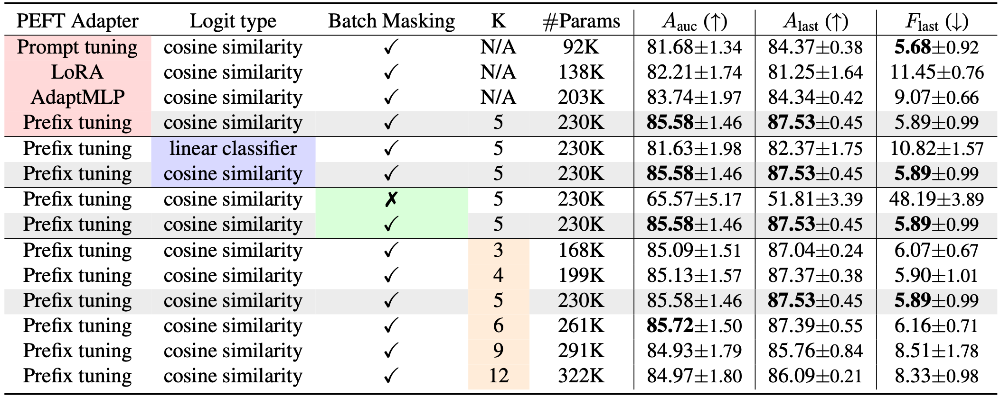

# SinglePrompt (CVPRF 2026)

Pytorch Implementation for [Is Prompt Selection Necessary for Task-Free Online Continual Learning?]

## Overview
We propose a simple yet effective SinglePrompt that eliminates the need for prompt selection and focuses on classifier optimization. Specifically, we simply (i) inject a single prompt into each self-attention block, (ii) employ a cosine similarity-based logit design to alleviate the forgetting effect inherent in the classifier weights, and (iii) mask logits for unexposed classes in the current minibatch.
<p align="center">

</p>

---

## Install
```bash
conda env create -f environment.yml
conda activate tfocl
```

---

##  How to Run

###  1. Training without Buffer

#### CIFAR100
```bash
bash scripts/buffer0_cifar.sh
```
#### Tiny Imagenet
```bash
bash scripts/buffer0_tiny.sh
```
#### Imagent-R
```bash
bash scripts/buffer0_imgr.sh
```

###  2. Buffer-based Training

Supervised training enhanced with memory replay (buffer).

#### CIFAR100
```bash
bash scripts/buffer{MEM_SIZE}_cifar.sh
```
#### Tiny Imagenet
```bash
bash scripts/buffer{MEM_SIZE}_tiny.sh
```
#### Imagent-R
```bash
bash scripts/buffer{MEM_SIZE}_imgr.sh
```

Modify the following arguments in the script:

- **Buffer size**  
  Change `MEM_SIZE` to control the buffer size.  
  Examples:
  - `MEM_SIZE=500`
  - `MEM_SIZE=2000`
 
---

## Experiments
### Image Classification on Si-Blurry Benchmark
We compare our proposed simple baseline to prior works in Online Continual Learning.
<p align="center">

</p>

### Component Ablation Studies
<p align="center">

</p>

---

## Citation

```bibtex
@inproceedings{park2026singleprompt,
  title={Is Prompt Selection Necessary for Task-Free Online Continual Learning?},
  author={Park, Seoyoung and Lee, Haemin and Lee, Hankook},
  booktitle = {Proceedings of the IEEE/CVF Conference on Computer Vision and Pattern Recognition-FINDINGS Track (CVPRF)},
  year={2026}
}
```
---

## Acknowledgement

This implementation is developed based on the source code of [MISA](https://github.com/kangzhiq/MISA), [MVP](https://github.com/KU-VGI/Si-Blurry).
